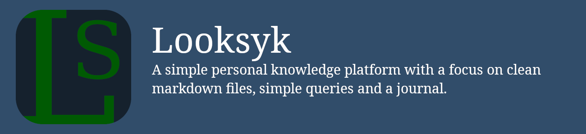
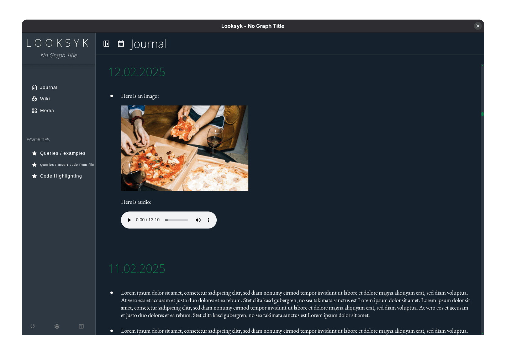

# Looksyk

A simple personal knowledge platform with a focus on clean markdown files, simple queries and a journal.

## Key Features

- **Local Storage**: Your information is always exclusively in Markdown files.
- **Fast and Efficient**: Scans and indexes large knowledge bases in under a second.
- **Developer-Centric**: Insert code blocks with syntax highlighting, save and display existing code files. Save and
  display backups of websites in your pages.
- **Simple Queries**: Use case based query language.
- **Customizable Design**: Configure your own design or choose from three themes: light mode, dark mode (default), and
  extra dark mode.

Read more
in [What are the key selling points compared to other knowledge platforms?](#what-are-the-key-selling-points-compared-to-other-knowledge-platforms)

## Table of Contents

- [Introduction](#introduction)
- [Key Selling Points](#what-are-the-key-selling-points-compared-to-other-knowledge-platforms)
- [Implemented Features](#implemented-features)
- [Out of Scope](#out-of-scope)
- [License](#license)

### Further Reading

- [idea and technical concept](docs/idea_and_technical_concept.md)
- [Install + Run](docs/installation.md)
- [Migrate Your Existing Logseq Graph](docs/migration_from_logseq.md)
- [Configuration and Usage](docs/usage.md)
- [Changelog](docs/changelog.md)

## Introduction

I have always been a fan of [Logseq](https://logseq.com/), but there were a few things that bothered me, such as the
many control characters in the markdown files, the query language that is difficult to learn and limited in its
capability, or the general performance.
When the database version announced the move away from Markdown as the leading data storage format, I tried to write my
own client: Looksyk (name may need to be changed).

### What are the key selling points compared to other knowledge platforms?

* Runs local on your computer.
* Your information is always exclusively in the Markdown files. No replication in a database or similar. The files can
  be easily synchronized with other sync tools.
* Based on blocks, but these can also be larger, contain entire chapters and multiple queries.
* Simple, use case based query language.
* Multiple instances of Looksyk with different knowledge bases can be opened in parallel.
* Developer-centric file support:
	* Insert code blocks with syntax highlighting
	* Save and display existing code files in your pages with syntax highlighting
	* Save and display backups of websites in your pages (with single-file-downloader)
	* Insert videos, audio files, images, text files and PDFs.

[Check out screenshots to see how each feature can be used!](https://sebastianrzk.github.io/Looksyk/usage.html)

Install it and try it out! [Installation Guide](https://sebastianrzk.github.io/Looksyk/installation.html)

### Implemented Features

* Pages
* Journal (infinite scrolling page, single day page, journal overview page)
* Todos
* Content assist
	* Creating links, inserting queries, tags and media
* View (and link) media
	* Images
	* PDFs
	* HTML Files (e.g. SingleFile saved pages
	  from [SingleFile Firefox](https://addons.mozilla.org/en-US/firefox/addon/single-file/)
	  or [SingleFile Chrome](https://chromewebstore.google.com/detail/singlefile/mpiodijhokgodhhofbcjdecpffjipkle))
	* Video (html5 video player)
	* Audio (html5 audio player)
	* Code (with highlighting)
	* Text files
* Queries (placeholders for dynamic content):
	* Query blocks
	* Query todos
	* Query page hierarchy
	* Query references
	* Render video, audio, images, text files and code files (with highlighting)
* Search across all pages and journals
* Delete and rename pages (and update references across all pages and journals)
* Favourites
* History: Show, drop, navigate to previous and next page. Keyboard shortcuts available.

Are you missing something? Create an [issue](https://github.com/SebastianRzk/Looksyk/issues) and/or a [pull request](https://sebastianrzk.github.io/Looksyk/development_and_contribution.html)!

How can you get the most out of Looksyk with these features? Learn more in the [Configuration and Usage page](https://sebastianrzk.github.io/Looksyk/usage.html) .

Install it and try it out! [Installation Guide](https://sebastianrzk.github.io/Looksyk/installation.html)

### Out of scope

* Non-Markdown content (e.g. flashcards, whiteboards)
* PDF annotation
* Dynamic backend plugins
* Server version / multi user / rcs
* i18n
* Sync with other devices. Please use other tools to sync your knowledge base such as
	* [Microsoft OneDrive](https://www.microsoft.com/microsoft-365/onedrive/)
	* [Dropbox](https://www.dropbox.com/)
	* [Nextcloud](https://nextcloud.com/)
	* [Syncthing](https://syncthing.net/)
	* [git](https://git-scm.com/)

## Development

- [Development Guide and Contribution Guidelines](docs/development_and_contribution.md)

## License

This project is licensed under the AGPL3 License - see the `LICENSE` file for details.
