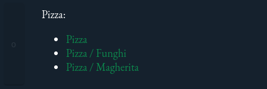
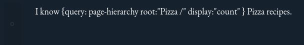
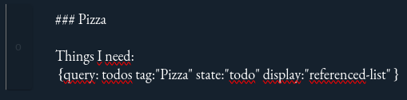
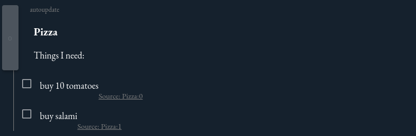
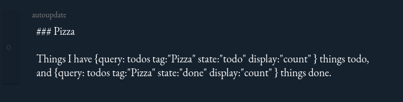

# Looksyk


A simple personal knowledge platform with a focus on clean markdown files, simple queries and a journal.

Read more
in [What are the key selling points compared to other knowledge platforms?](#what-are-the-key-selling-points-compared-to-other-knowledge-platforms)


## Table of Contents

- [Introduction](#introduction)
- [Current Status](#current-status)
	- [Technical concept](#technical-concept)
	- [Project work and future](#project-work-and-future)
	- [Key Selling Points](#what-are-the-key-selling-points-compared-to-other-knowledge-platforms)
	- [Implemented Features](#implemented-features)
	- [Out of Scope](#out-of-scope)
- [Run Looksyk](#run-looksyk)
	- [Production Build / Installation](#production-build--installation)
	- [Running Different Looksyk Graphs](#running-different-looksyk-graphs-at-the-same-time-with-different-ports)
	- [Development Build](#development-build)
- [Migrate Your Existing Logseq Graph](#migrate-your-existing-logseq-graph-to-looksyk)
- [Configuration](#configuration)
- [Data Storage](#data-storage)
- [Design](#design)
	- [Dark Mode (default)](#dark-mode-default)
	- [Light Mode / Solarized Light](#light-mode--solarized-light)
	- [Extra Dark Mode](#extra-dark-mode)
- [Usage](#usage)
	- [Markdown Syntax and Features](#markdown-syntax-and-features)
	- [Page names and hierarchy](#page-names-and-hierarchy)
	- [Favorites](#favorites)
	- [Code](#code)
	- [Todos](#todos)
	- [Queries](#queries)
		- [Query Page Hierarchy](#query-page-hierarchy)
		- [Query Todos](#query-todos)
		- [Query Backlinks](#query-backlinks)
		- [Query Render Assets ("insert-content-from-file")](#query-render-assets-insert-content-from-file)
- [Contribution Guidelines](#contribution-guidelines)
- [License](#license)
- [Changelog (external file)](docs/changelog.md)

## Introduction

I have always been a fan of [Logseq](https://logseq.com/), but there were a few things that bothered me, such as the
many control characters in the markdown files, the query language that is difficult to learn and limited in its
capability, or the general performance.
When the database version announced the move away from Markdown as the leading data storage format, I tried to write my
own client: Looksyk (name may need to be changed).

## Current status

### Technical concept

With Looksyk I want to create a local platform to collect information.

Currently, the backend renders all content in Markdown, which is displayed with [Marked](https://marked.js.org/) in the
frontend. This makes Looksyk relatively close to the Markdown standard. Code highlighting is done
with [highlightjs](https://highlightjs.org/) and emojis with [openmoji](https://openmoji.org/). The application is
wrapped in an electron app (with [electron forge](https://www.electronforge.io/)).

Even if the project is currently a pure web project, I would not deploy it publicly because the project in its current
state has not paid much attention to security (for example Injection-Attacks or Path-Traversal-Attacks).

Currently, the backend is very fast, my [Logseq](https://logseq.com/) graph (~900 pages and 900kb text) is
scanned and indexed in under a second (~80ms on a 3-year-old Laptop). That's why Looksyk does not have a database,
reading
new data into RAM is fast enough.

The frontend still has some challenges. Performance and design can be improved and sometimes scrolling on the journal
page has issues.

Tested browsers:

| Browser                        | Compatibility                                                        |
|--------------------------------|----------------------------------------------------------------------| 
| application-wrapper (Electron) | works                                                                |
| Chromium / Chrome              | works                                                                |
| Firefox                        | works on nightly (Jan 2025), contenteditable=plaintext-only required |

Tested operating systems

| OS      | Compatibility                                                                                                                                                                                                                                                                       |
|---------|-------------------------------------------------------------------------------------------------------------------------------------------------------------------------------------------------------------------------------------------------------------------------------------|
| Linux   | works                                                                                                                                                                                                                                                                               |
| Windows | Not tested. The build script certainly doesn't work (at least not without WSL). In addition, the resolution of the home directory may fail (please specify `--graph-location`) and the desktop shortcut doesn't work. Otherwise, Looksyk should be programmed platform independent. |
| MacOs   | Not tested. Keyboard shortcuts are currently only designed for a Windows keyboard layout, but this can be changed via a pull request. There are also likely to be challenges in the build script. Otherwise, Looksyk is programmed to be platform-independent.                      |

### Project work and future

The project is a little hobby of mine, and I program a few lines sometimes when I feel like it and have the time.

I am happy about every contribution, but I cannot guarantee that I will implement every feature request.

If you have any changes or suggestions, please send me a pull request.
For feature requests and bugs, you can submit an issue (or a pull request if you can).

### What are the key selling points compared to other knowledge platforms?

* Runs local on your computer.
* Your information is always exclusively in the Markdown files. No replication in a database or similar. The files can
  be easily synchronized with other sync tools.
* Based on blocks, but these can also be larger, contain entire chapters and multiple queries.
* Simple, use case based query language.
* Multiple instances of Looksyk with different graphs can be opened in parallel.
* Developer-centric file support:
	* Insert code blocks with syntax highlighting
	* Save and display existing code files in your pages with syntax highlighting
	* Save and display backups of websites in your pages (with single-file-downloader)
	* Insert videos, audio files, images, text files and PDFs.

### Implemented Features

* Pages
* Journal
* Todos
* Content assist
	* Creating links, inserting queries, tags and media
* View (and link) media
	* Images
	* PDFs
	* HTML Files (e.g. SingleFile saved pages
	  from [SingleFile Firefox](https://addons.mozilla.org/en-US/firefox/addon/single-file/)
	  or [SingleFile Chrome](https://chromewebstore.google.com/detail/singlefile/mpiodijhokgodhhofbcjdecpffjipkle))
	* Video (html5 video player)
	* Audio (html5 audio player)
	* Code (with highlighting)
	* Text files
* Queries (placeholders for dynamic content)
	* Query todos
	* Page hierarchy
	* References
	* Render video, audio, images, text files and code files (with highlighting)
* Search across all pages and journals
* Delete and rename pages (and update references across all pages and journals)
* Favourites
* History: Show, drop, navigate to previous and next page. Keyboard shortcuts available.

### Out of scope

* Non-Markdown content (e.g. flashcards, whiteboards)
* PDF annotation
* Dynamic backend plugins
* Server version / multi user / rcs
* i18n
* Sync with other devices. Please use other tools
  like [Nextcloud](https://nextcloud.com/install/), [git](https://git-scm.com/)
  or [OneDrive](https://www.microsoft.com/de-de/microsoft-365/onedrive/online-cloud-storage) to sync your graph

## Run Looksyk

### Production Build / Installation

1. Run the script `bash build.sh` (this will build the frontend and backend, and requires `npm` and `cargo`)
2. The application is now in the `target` folder
3. (Optional) Create a shortcut icon `sh create_desktop_shortcut.sh`
4. Start the application. Use the created shortcut or run `./application-wrapper/looksyk` in the `target` folder. You
   can instrument the
   application with the arguments `--port` and `--graph-location` to change the port and the graph location, and with
   `--title` to change the title. With the argument `--devtools true` the electron devtools are opened as default.
5. The application is now available at `http://localhost:8989` (or the configured port)

### Running different looksyk graphs at the same time (with different ports)

You can use the `create_desktop_shortcut.sh` script to create a shortcut with a different port and graph location. Or
you can run the application with the arguments `--port`, `--graph-location` and `--title` manually.

### Development Build

#### Build backend and frontend

1. Clone the repository
2. Install frontend dependencies and run `cd frontend/looksyk`, `npm install`, `ng serve`
3. Install backend dependencies and run `cd backend` and `cargo run`
4. The application is now available at `http://localhost:4200` (frontend) and `http://localhost:8989` (backend)

#### Build electron app

1. Change into the application-wrapper directory `cd application-wrapper`
2. Install electron dependencies `npm install`
3. Build the electron app `npm run package`
4. The application is now in the `out` folder e.g. `out/looksyk-linux-x64/looksyk`

### Migrate your existing Logseq graph to Looksyk

1. Start the application to create an empty graph
2. Copy your journals into the journal folder (`~/graph/journals`)
3. Copy your pages into the pages folder (`~/graph/pages`)
4. Copy your assets into the assets folder (`~/graph/assets`)
5. Start / Restart the backend
6. (Optional): Replace all asset references `(some name)[../assets/assetName]` with `(some name)[/assets/assetName]` in
   your
   pages so 'on click' navigates to the media preview page and does not download the file.
7. (Optional): Replace all labels `#myTag` with `[[myTag]]` in your pages so the tags are recognized by the backend.
8. (Optional): Replace your queries with the Looksyk query syntax
9. (Optional): Replace your todos with the markdown checkbox / todo syntax. '[x]' for done, '[ ]' for todo.

## Configuration

The configuration is done in the `config.json` file in the directory `~/.local/share/looksyk`. This path can be changed
with the environment variable `LOOKSYK_CONFIG_PATH`.

The default graph location is in `~/graph` (or the configured location in the `config.json`).

The application port and the graph location can be provided by arguments ( `--port` and `--graph-location`).

The application title can be modified with the argument `--title`.

## Usage

### Data Storage

The `graph` folder in the home directory contains all data.

* `pages` contains all pages
* `journals` contains all journals
* `assets` contains all media files (images, videos, audio files, text files, PDFs), deduplicated by checksum
* `config` contains the configuration
	* `config.json` contains the configuration (design, favourites)
	* `media.json` contains all the checksums of the media files

### Design

The design is based on the [Material Design](https://material.io/design) guidelines. All colors can be configured in the
`config.json` file.

The following color values are supported:

* Predefined browser-colors (e.g. `black`, `white`)
* RGB `rgb(R, G, B)` (e.g. `rgb(255, 0, 0)`)
* RGBA `rgba(R, G, B, A)` (e.g. `rgba(255, 0, 0, 0.5)`)
* Hex `#RRGGBB` (e.g. `#FF0000`)
* HSL `hsl(H, S%, L%)` (e.g. `hsl(0, 100%, 50%)`)
* HSLA `hsla(H, S%, L%, A)` (e.g. `hsla(0, 100%, 50%, 0.5)`)

The design consists of the following elements:

* `primaryColor` is the color of the primary elements (e.g. links, buttons)
* `backgroundColor` is the color of the background
* `foregroundColor` is the color of the text
* `primaryShading` is the color of the shading, used for the sidebar, the hover effect and the active element

Inspire yourself with the following examples:

#### Dark Mode (default)


Configuration:

```json
"design": {
"primaryColor": "#0c884c",
"backgroundColor": "#15212D",
"foregroundColor": "white",
"primaryShading": "rgba(255, 255, 255, 0.1)"
}
```

#### Light Mode / Solarized Light


Configuration:

```json
"design": {
"primaryColor": "#859900",
"backgroundColor": "#fdf6e3",
"foregroundColor": "#002b36",
"primaryShading": "rgba(0, 0, 0, 0.1)"
}
```

#### Extra Dark Mode


Configuration:

```json
"design": {
"primaryColor": "#859900",
"backgroundColor": "black",
"foregroundColor": "white",
"primaryShading": "rgba(255, 255, 255, 0.1)"
}
```

### Markdown Syntax and Features

* `[[a link]]` creates a link to a page, typing `[[` opens the content assist in "insert link mode"
* <kbd>Ctrl</kbd>+<kbd>Enter</kbd> creates a new block
* Insert emojis with `:emoji:` (all emojis from [openmoji](https://openmoji.org/) available)
* <kbd>Ctrl</kbd>+<kbd>Space</kbd> opens the content assist
	* With open markdown block -> "insert mode"
	* With no open markdown block -> "navigation mode"
* <kbd>Alt</kbd>+<kbd>Left</kbd> Navigate to the previous page
* <kbd>Alt</kbd>+<kbd>Right</kbd> Navigate to the next page
* <kbd>Ctrl</kbd>+<kbd>R</kbd> Refresh the current page
* Lists inside of blocks are supported.
	* Unordered lists are supported with `*` (and not with `-`, because `-` starts a new block)
	* Ordered lists are supported with `1.`, `2.` ...
* <kbd>Ctrl</kbd>+<kbd>Shift</kbd>+<kbd>F</kbd> opens the content assist in "search mode" (case-sensitive search across
  all pages and journals)
* <kbd>Ctrl</kbd>+<kbd>+</kbd> / <kbd>.</kbd> and <kbd>Ctrl</kbd>+<kbd>-</kbd> zoom in and out, <kbd>Ctrl</kbd>+<kbd>
  0</kbd> resets the zoom

### Page names and hierarchy


* Every tag `[[myTag]]` links to a page with the name `myTag`
* To create a hierarchy, use the `/` character in the page name. `[[myTag / mySubTag]]` creates a page
  `mySubTag` with the parent tag `myTag`
  and the parent tag `myTag`
* You can navigate to the parent page by clicking on the parent tag in the page header
* You can query the page hierarchy with the query `page-hierarchy` (see [page hierarchy](#query-page-hierarchy))

### Favorites


* You can mark a page as favorite by clicking on the star next to the page title
* Favorites are displayed in the sidebar
* You can reorder the favorites by dragging them

### Code

* Code block start with three backticks and the language name (e.g. ```rust)
* Code blocks are highlighted with [highlightjs](https://highlightjs.org/). For proper highlighting, the language name
  must be
  provided
* Code blocks can be inserted with the query `insert-file-content` (
  see [render assets](#query-render-assets-insert-content-from-file))

### Todos

* Todo-blocks are blocks with a leading `[ ]` for todo or `[x]` for done. The rendered block has a checkbox that can be
  toggled
* You can query todos with the query `todos` (see [todos](#todos))
* A todo block can be associated with a tags.
	* The todo is always tagged with the tag of the page it is on. If the todo is
	  on a page with the tag `myTag`, the todo is also tagged with `myTag`.
	* Furthermore, the todo can be tagged with a custom tag. All tags that are in the todo block are associated with the
	  todo.
	* All tags in previous blocks that have a lower indentation will also be associated with the todo.

### Queries

Queries are placeholders for dynamic content in Markdown. The result of the query is calculated and displayed
dynamically at runtime, whereby only the query syntax and not the result is stored in the Markdown file on disk.

Queries are particularly suitable for three problems:

* Content that changes continuously over time and where the references should be dynamically adapted across all pages.
  For example, "Which todos for the tag "myTag" are not yet completed?" or "which subpages does the page myTag have?".
* Content that is not stored in the Markdown file, but should be displayed in the Markdown file. For example, "Insert
  the content of the file myFile.asdf as a code block" or "Insert the content of the file myFile.mp4 as a video".
* Content that is not supported by the Markdown standard, but should be displayed in the Markdown file. For example, "
  Insert a video" or "Insert an audio file".

Currently,all queries must be inserted exactly as described. Parameters cannot yet be swapped or omitted.

#### Query Page Hierarchy

Quick examples:

```
 Show a list of links
 {query: page-hierarchy root:"myRootTag" display:"inplace-list" }
 
 Show the count
 {query: page-hierarchy root:"myRootTag" display:"count" }
```

Display types:

* **inplace-list**
	* Creates a list of the selected pages in the markdown-block. Each item is prefixed with a icon, and the location as
	  link. The list is not modifiable.
	* Query without trailing slash 
	* Result 
	* Query with trailing slash 
	* Result 
* **count**
	* Creates a number of the selected pages in the markdown-block.
	* Query 
	* Result 

#### Query Todos

Quick examples:

```
 Show a list of todos with a checkbox and a link to the source file. The list is appended to the end of the current block
 {query: todos tag:"myTag" state:"todo" display:"referenced-list" }
 
 Show a list of todos (not modifiable, but renders in place)
 {query: todos tag:"myTag" state:"todo" display:"inplace-list"} 
 
 Show the count of todos
 {query: todos tag:"myTag" state:"todo" display:"count" }
 
 Show done todos
 {query: todos tag:"myTag" state:"done" display:"referenced-list" }
```

Display-types:

* **referenced-list**
	* Creates a list of the selected todos at the end of the current block. Each item contains a checkbox and a link to
	  the
	  source file. If the checkbox is clicked, the todo is marked as done. Query-results can be stacked.
    * Query 
      
      
	* Result 

      
  	
* **inplace-list**
	* Creates a list of the selected todos in the markdown-block. Each item is prefixed with a icon. The list is not
	  modifiable.
	* Query 
  
      
	* Result 
  
      
	* Result (done) 
  
      
* **count**
	* Creates a number of the selected todos in the markdown-block.
	* Query 

      
	* Result 
  
      

#### Query Backlinks

```
 Show a list of backlinks
 {query: references-to tag:"myTag" display:"referenced-list" }
 
 Show the count
 {query: references-to tag:"myTag" display:"count" }
```

#### Query Render Assets ("insert-content-from-file")

```
 Insert the content of a file as text block
 {query: insert-file-content target-file:"myFile.asdf" display:"inline-text" }
 
 
 Insert the content of a file as code block, and highlight the code
 {query: insert-file-content target-file:"myFile.asdf" display:"code-block" }
 
 
 Insert a video
 {query: insert-file-content target-file:"myFile.mp4" display:"video" }
 
 
 Insert an audio file
 {query: insert-file-content target-file:"myFile.ogg" display:"audio" }
```

### History


Looksyk has a history feature that allows you to navigate to the previous and next page. The history is stored in the
local storage of the browser and is not synchronized with other devices.

The history is displayed in the sidebar and can be dropped. The history is limited to 5 visible entries,
but all entries are stored in the local storage.


## Contribution Guidelines

1. Fork the repository.
2. Create a new branch (`git checkout -b feature-branch`).
3. Make your changes.
4. Commit your changes (`git commit -am 'Add new feature'`).
5. Push to the branch (`git push origin feature-branch`).
6. Create a new Pull Request.

## License

This project is licensed under the AGPL3 License - see the `LICENSE` file for details.
