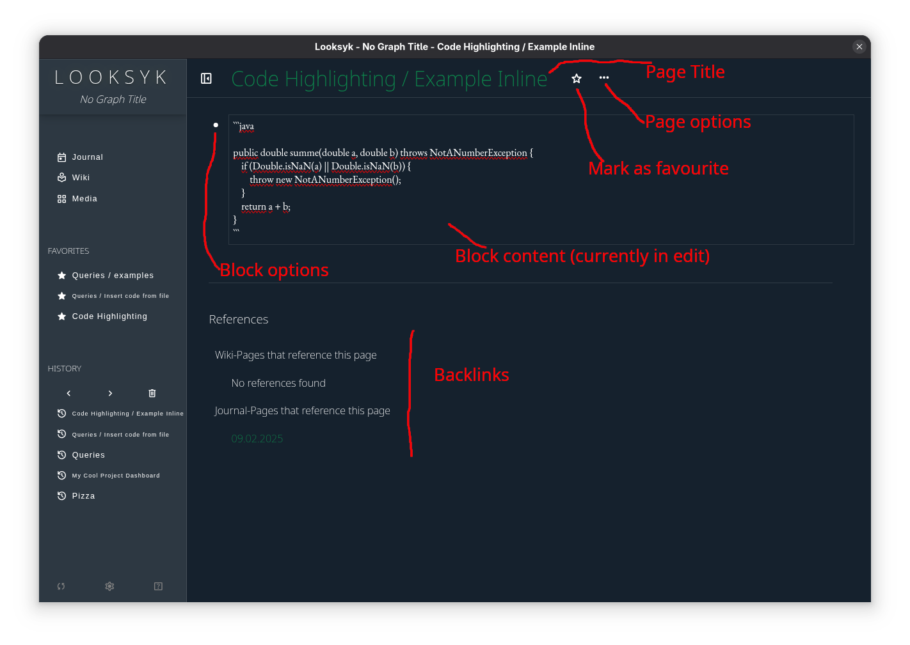
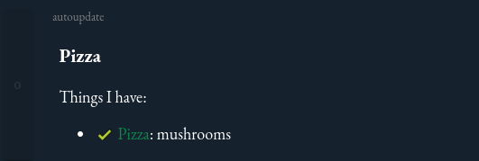

# Configuration and Usage

## Table of Contents

### This page

- [Configuration](#configuration)
- [Usage](#usage)
	- [Data Storage](#data-storage)
	- [Design](#design)
		- [Dark Mode (default)](#dark-mode-default)
		- [Light Mode / Solarized Light](#light-mode--solarized-light)
		- [Extra Dark Mode](#extra-dark-mode)
	- [Markdown Syntax and Features](#markdown-syntax-and-features)
	- [Page names and hierarchy](#page-names-and-hierarchy)
	- [Favorites](#favorites)
	- [Code](#code)
	- [Todos](#todos)
	- [Queries](#queries)
		- [Query Page Hierarchy](#query-page-hierarchy)
		- [Query Todos](#query-todos)
		- [Query Backlinks](#query-backlinks)
		- [Query Render Assets ("insert-content-from-file")](#query-render-assets-insert-content-from-file)
		- [Query Blocks](#query-blocks)
- [History](#history)

### Further Reading

- [Overview](index.md)
- [idea and technical concept](idea_and_technical_concept.md)
- [Install + Run](installation.md)
- [Migrate Your Existing Logseq Graph](migration_from_logseq.md)
- [Configuration and Usage](usage.md)
- [Development Guide and Contribution Guidelines](development_and_contribution.md)
- [Changelog](changelog.md)

## Configuration

The configuration is done in the `config.json` file in the directory `~/.local/share/looksyk`. This path can be changed
with the environment variable `LOOKSYK_CONFIG_PATH`.

The default graph location is in `~/graph` (or the configured location in the `~/.local/share/looksyk/config.json`).

The command `looksyk` accepts the following command line arguments:

* `--graph-location` to specify the location of the graph (default: `~/graph`)
* `--port` to specify the port of the backend (default: `11000`)
* `--window-width` to specify the width of the window (default: `1200`)
* `--window-height` to specify the height of the window (default: `800`)
* `--window-zoom` to specify the zoom level of the window (default: `-0.6`)

Note for Flatpak from FlatHub users (this does not apply to the manual flatpak-build or the download from github):
Changing the graph location is only possible, if the Flatpak is run with the `--filesystem=home` option, otherwise the
graph location is fixed to `~/graph`.

## Usage


Overview of Looksyk's basic features in the Journal view.



Overview of Looksyk's basic features in the Page view.

### Data Storage

The `graph` folder in the home directory contains all data.

* `pages` contains all pages
* `journals` contains all journals
* `assets` contains all media files (images, videos, audio files, text files, PDFs), deduplicated by checksum
* `config` contains the configuration
	* `config.json` contains the configuration (design, favourites)
	* `media.json` contains all the checksums of the media files

### Design

The design is based on the [Material Design](https://material.io/design) guidelines.

There are two ways to customize the design:

* Changing predefined color variables in the `config/config.json` file (see description below)
* Adding custom CSS in the `config/user-theme.css` file.

The following color values are supported:

* Predefined browser-colors (e.g. `black`, `white`)
* RGB `rgb(R, G, B)` (e.g. `rgb(255, 0, 0)`)
* RGBA `rgba(R, G, B, A)` (e.g. `rgba(255, 0, 0, 0.5)`)
* Hex `#RRGGBB` (e.g. `#FF0000`)
* HSL `hsl(H, S%, L%)` (e.g. `hsl(0, 100%, 50%)`)
* HSLA `hsla(H, S%, L%, A)` (e.g. `hsla(0, 100%, 50%, 0.5)`)

The design consists of the following elements:

* `primaryColor` is the color of the primary elements (e.g. links, buttons)
* `backgroundColor` is the color of the background
* `foregroundColor` is the color of the text
* `primaryShading` is the color of the shading, used for the sidebar, the hover effect and the active element
* `appearance` is the appearance of the application, either `dark` or `light`. This is used to set the default color
  scheme of the application. The default value is `dark`.

Inspire yourself with the following examples:

#### Dark Mode (default)


Configuration:

```json
"design": {
"primaryColor": "#0c884c",
"backgroundColor": "#15212D",
"foregroundColor": "white",
"primaryShading": "rgba(255, 255, 255, 0.1)",
"appearance": "dark"
}
```

#### Light Mode / Solarized Light


Configuration:

```json
"design": {
"primaryColor": "#859900",
"backgroundColor": "#fdf6e3",
"foregroundColor": "#002b36",
"primaryShading": "rgba(0, 0, 0, 0.1)",
"appearance": "light"
}
```

#### Extra Dark Mode


Configuration:

```json
"design": {
"primaryColor": "#859900",
"backgroundColor": "black",
"foregroundColor": "white",
"primaryShading": "rgba(255, 255, 255, 0.1)",
"appearance": "dark"
}
```

### Markdown Syntax and Features

* `[[a link]]` creates a link to a page, typing `[[` opens the content assist in "insert link mode"
* <kbd>Ctrl</kbd>+<kbd>Enter</kbd> creates a new block
* Insert emojis with `:emoji:` (all emojis from [openmoji](https://openmoji.org/) available)
* <kbd>Ctrl</kbd>+<kbd>Space</kbd> (alternative 1: <kbd>⌥ meta</kbd> + <kbd>Space</kbd>, alternative 2: <kbd>
  Ctrl</kbd> + <kbd>k</kbd>  e.g. for MacOS / Arch) opens the content assist
	* With open markdown block -> "insert mode"
	* With no open markdown block -> "navigation mode"
* <kbd>Alt</kbd>+<kbd>Left</kbd> Navigate to the previous page
* <kbd>Alt</kbd>+<kbd>Right</kbd> Navigate to the next page
* <kbd>Ctrl</kbd>+<kbd>R</kbd> Refresh the current page
* Lists inside of blocks are supported.
	* Unordered lists are supported with `*` (and not with `-`, because `-` starts a new block)
	* Ordered lists are supported with `1.`, `2.` ...
* <kbd>Ctrl</kbd>+<kbd>Shift</kbd>+<kbd>F</kbd> opens the content assist in "search mode" (case-sensitive search across
  all pages and journals)
* <kbd>Ctrl</kbd>+<kbd>+</kbd> / <kbd>.</kbd> and <kbd>Ctrl</kbd>+<kbd>-</kbd> zoom in and out, <kbd>Ctrl</kbd>+<kbd>
  0</kbd> resets the zoom

### Page names and hierarchy


* Every tag `[[myTag]]` links to a page with the name `myTag`
* To create a hierarchy, use the `/` character in the page name. `[[myTag / mySubTag]]` creates a page
  `mySubTag` with the parent tag `myTag`
  and the parent tag `myTag`
* You can navigate to the parent page by clicking on the parent tag in the page header
* You can query the page hierarchy with the query `page-hierarchy` (see [page hierarchy](#query-page-hierarchy))

### Favorites


* You can mark a page as favorite by clicking on the star next to the page title
* Favorites are displayed in the sidebar
* You can reorder the favorites by dragging them

### Code

* Code block start with three backticks and the language name (e.g. ```rust)
* Code blocks are highlighted with [highlightjs](https://highlightjs.org/). For proper highlighting, the language name
  must be
  provided
* Code blocks can be inserted with the query `insert-file-content` (
  see [render assets](#query-render-assets-insert-content-from-file))

### Todos

* Todo-blocks are blocks with a leading `[ ]` for todo or `[x]` for done. The rendered block has a checkbox that can be
  toggled
* You can query todos with the query `todos` (see [todos](#todos))
* A todo block can be associated with a tags.
	* The todo is always tagged with the tag of the page it is on. If the todo is
	  on a page with the tag `myTag`, the todo is also tagged with `myTag`.
	* Furthermore, the todo can be tagged with a custom tag. All tags that are in the todo block are associated with the
	  todo.
	* All tags in previous blocks that have a lower indentation will also be associated with the todo.

### Templates

Pages that start with the prefix `Template /` are treated as templates. Templates can easily inserted by the
content-assist when editing a page.

The first block of a template is appendet to the current block in edit, all following blocks are inserted as new blocks.
This allows you to create templates with multiple blocks, which are inserted as new blocks in the current page.
Templates can be used to create reusable content, such as checklists, meeting notes, or project plans.

The indentation of the blocks in the template is preserved, so you can create nested blocks. The initial block in edit
is considered as starting-point, the template is inserted at the same indentation level and the following blocks are
inserted with the relative indentation to the first block.

### Queries

Queries are placeholders for dynamic content in Markdown. The result of the query is calculated and displayed
dynamically at runtime, whereby only the query syntax and not the result is stored in the Markdown file on disk.

Queries are particularly suitable for three problems:

* Content that changes continuously over time and where the references should be dynamically adapted across all pages.
  For example, "Which todos for the tag "myTag" are not yet completed?" or "which subpages does the page myTag have?".
* Content that is not stored in the Markdown file, but should be displayed in the Markdown file. For example, "Insert
  the content of the file myFile.asdf as a code block" or "Insert the content of the file myFile.mp4 as a video".
* Content that is not supported by the Markdown standard, but should be displayed in the Markdown file. For example, "
  Insert a video" or "Insert an audio file".

Currently,all queries must be inserted exactly as described. Parameters cannot yet be swapped or omitted.

#### Query Page Hierarchy

Quick examples:

```
 Show a list of links
 {query: page-hierarchy root:"myRootTag" display:"inplace-list" }
 
 Show the count
 {query: page-hierarchy root:"myRootTag" display:"count" }
```

Display types:

* **inplace-list**
	* Creates a list of the selected pages in the markdown-block. Each item is prefixed with a icon, and the location as
	  link. The list is not modifiable.
	* Query without trailing slash 
	* Result 
	* Query with trailing slash 
	* Result 
* **count**
	* Creates a number of the selected pages in the markdown-block.
	* Query 
	* Result 

#### Query Todos

Quick examples:

```
 Show a list of todos with a checkbox and a link to the source file. The list is appended to the end of the current block
 {query: todos tag:"myTag" state:"todo" display:"referenced-list" }
 
 Show a list of todos (not modifiable, but renders in place)
 {query: todos tag:"myTag" state:"todo" display:"inplace-list"} 
 
 Show the count of todos
 {query: todos tag:"myTag" state:"todo" display:"count" }
 
 Show done todos
 {query: todos tag:"myTag" state:"done" display:"referenced-list" }
```

Display-types:

* **referenced-list**
	* Creates a list of the selected todos at the end of the current block. Each item contains a checkbox and a link to
	  the
	  source file. If the checkbox is clicked, the todo is marked as done. Query-results can be stacked.
	* Query

	  
	* Result

	  

* **inplace-list**
	* Creates a list of the selected todos in the markdown-block. Each item is prefixed with a icon. The list is not
	  modifiable.
	* Query

	  
	* Result

	  
	* Result (done)

	  
* **count**
	* Creates a number of the selected todos in the markdown-block.
	* Query

	  
	* Result

	  

#### Query Backlinks

```
 Show a list of backlinks
 {query: references-to tag:"myTag" display:"referenced-list" }
 
 Show the count
 {query: references-to tag:"myTag" display:"count" }
```

#### Query Render Assets ("insert-content-from-file")

```
 Insert the content of a file as text block
 {query: insert-file-content target-file:"myFile.asdf" display:"inline-text" }
 
 
 Insert the content of a file as code block, and highlight the code
 {query: insert-file-content target-file:"myFile.asdf" display:"code-block" }
 
 
 Insert a video
 {query: insert-file-content target-file:"myFile.mp4" display:"video" }
 
 
 Insert an audio file
 {query: insert-file-content target-file:"myFile.ogg" display:"audio" }
```

#### Query Blocks

* Inserts a blocks, that contain a certain tag

* **paragraphs**
	* Creates a section for every block in the markdown. The filename and block-index is rendered as headline (and
	  link), the content of the block is rendered as paragraph. Paragraphs are separated by a horizontal line. Good for
	  multi-line blocks
	* Query

	  
	* Result

	  
* **inplace-list**

	* Creates a list of the selected blocks in the markdown-block. Each item is prefixed with a list-icon. Best suited
	  for single-line blocks.
	* Query

	  

	* Result

	  

* **referenced-list**
	* Creates a list of the selected blocks at the end of the current block. Each item contains a link to
	  the source file. Different query-results can be stacked. Good for multi-line blocks
	* Query

	  
	* Result

	  
* **count**
	* Creates a number of the selected blocks in the markdown-block.

### History

Looksyk has a history feature that allows you to navigate to the previous and next page. The history is stored in the
local storage of the browser and is not synchronized with other devices.

The history is displayed in the sidebar and can be dropped. The history is limited to 5 visible entries,
but all entries are stored in the local storage.
